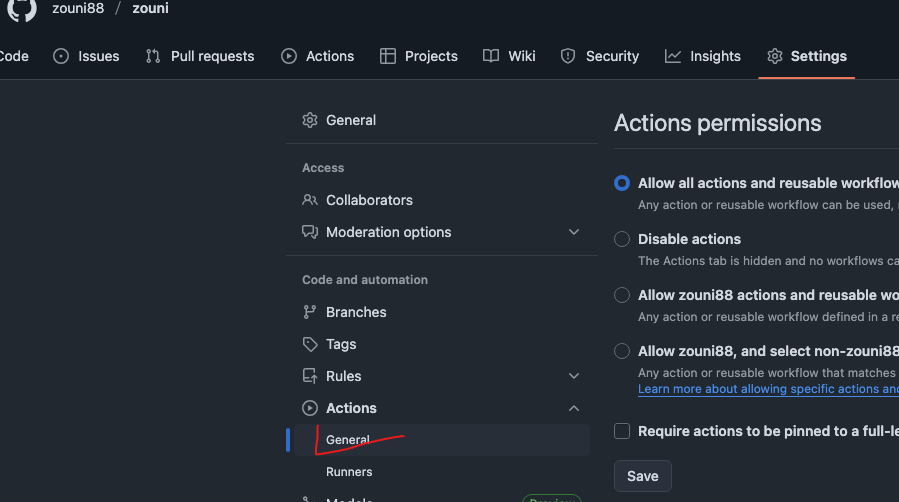

## 自动部署`mdbook`到githubpages，流程很简单，如下

### 1. `github`创建仓库：zouni

### 2. 仓库`settings` -> `Actions` -> `General` 下拉找到 `Workflow permissions` 选中第一项：工作流可读写权限，不勾选工作流没有操作权限



### 3. 接下来选中`Actions`,新建workflow,


### 3.1 工作名字+工作流内容
```yml
name: Build and Deploy
# 监听 master 分支上的 push 事件
on:
  push:
    branches:
      - main
jobs:
  deploy:
    # 构建环境使用 ubuntu
    runs-on: ubuntu-latest
    steps:
      # 官方action, 将代码拉取到虚拟机
      - name: Checkout
        uses: actions/checkout@v3
        with:
          persist-credentials: false

      # 步骤 2：安装 Rust 环境（mdBook 依赖 Rust，官方核心步骤）
      - name: Install Rust toolchain
        uses: dtolnay/rust-toolchain@stable  # 官方推荐的 Rust 安装插件（稳定版）
        with:
          toolchain: stable  # 使用稳定版 Rust（避免 nightly 版本兼容性问题）

      # 步骤 3：缓存 Rust 依赖（官方推荐，加速后续构建，减少重复下载）
      - name: Cache Rust dependencies
        uses: Swatinem/rust-cache@v2  # 官方推荐的 Rust 缓存插件

      # 步骤 4：安装 mdBook（工作流环境是全新的，需重新安装，官方步骤）
      - name: Install mdBook
        run: cargo install mdbook  # 与本地安装命令一致，官方标准方式

      - name: Build mdBook
        run: mdbook build  # 官方标准构建命令，生成 HTML/CSS/JS 等静态文件

      # 部署
      - name: Deploy
        uses: JamesIves/github-pages-deploy-action@v4.3.3
        with:
          # 项目配置的打包目录名称
          folder: book
          # 部署后提交到的分支
          branch: static-pages
```
### 4. 完成以上回到Actions会看到工作流已经在运行，等一会儿会自动创建好分支`static-pages`,接下来重新回到Settings

### 5. 完成以上，回到Actions,等待工作流运行结束，就可以访问了`username.github.io/mysite`

参考资料：
https://blog.csdn.net/weixin_43233914/article/details/134174562