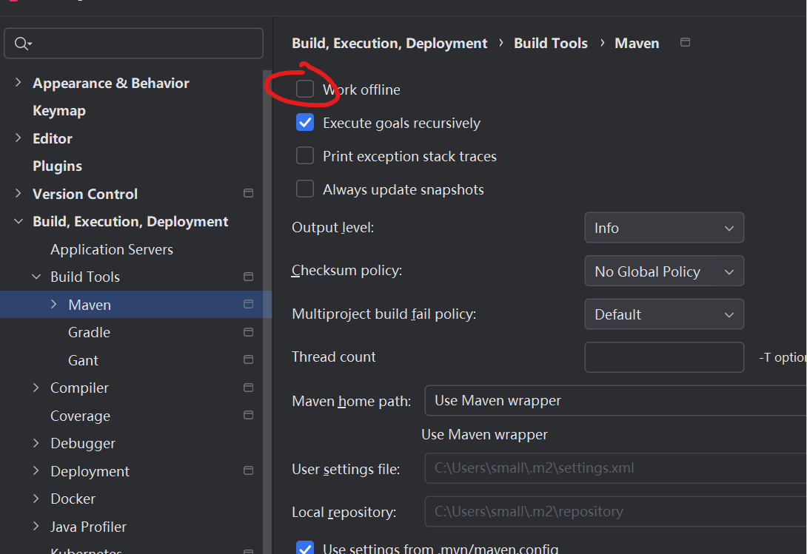

## 纯内网环境配置`maven`依赖
### 1. 将本地下载好的依赖和maven导入到内网电脑

仓库默认地址：
> C:/user/.m2/repository

maven默认地址：

> C:/user/.m2/wrapper/....

比如：
```shell
C:\Users\small\.m2\wrapper\dists\apache-maven-3.9.10-bin\53h08a94dg6djh6umvruv7q564\apache-maven-3.9.10
```

### 2. 拷贝到内网之后，在idea设置中设置离线模式


### 3. 修改settings.xml两个节点：`localRepositroy`和`mirror`  
文件路径： apache-maven-3.9.10\conf\settings.xml

localRepository
```xml
<localRepository>这里就是maven本地仓库地址</localRepository>
```
mirror
```xml
<mirror>
    <id>central</id>
    <name>central</name>
    <url>file://仓库地址</url>
    <mirrorOf>*</mirrorOf>
</mirror>
```
### 4. 以上都改完之后，要删除每个依赖文件夹下面的`_remote.repository`文件，不删除还是会从源地址拉取


进入到仓库根目录`/repository`，windows系统cmd执行命令：
```shell
for /r %i in (_remote.repository) do del %i
```

### 5. 最后项目同步，如果还是爆红，要根据自己下载的依赖版本具体到版本号


