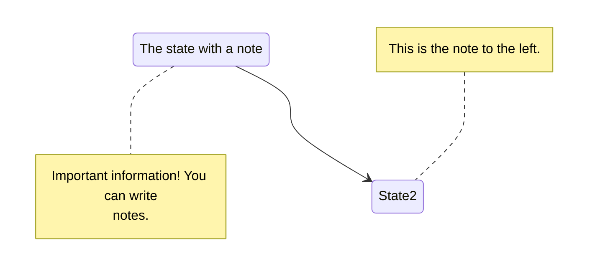
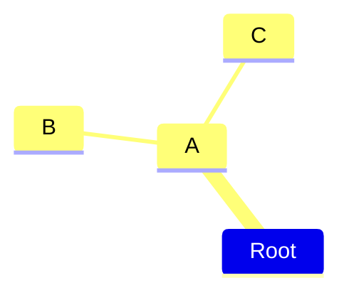
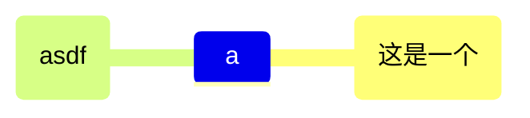
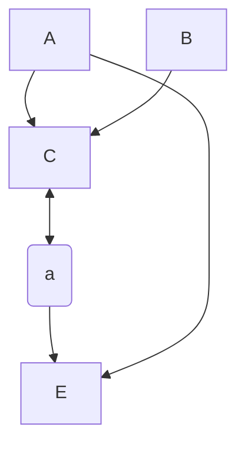

```mermaid
stateDiagram-v2
    State1: The state with a note
    note right of State1
        Important information! You can write
        notes.
    end note
    State1 --> State2
    note left of State2 : This is the note to the left.
```

``` mermaid
mindmap
Root
    A
      B
      C

```

```mermaid
mindmap
    a
        A--B(这是一个)
        B--C(asdf)

```

```mermaid
flowchart
    A & B--> C 
    C <--> D(a) --> E
    A --> E
```

